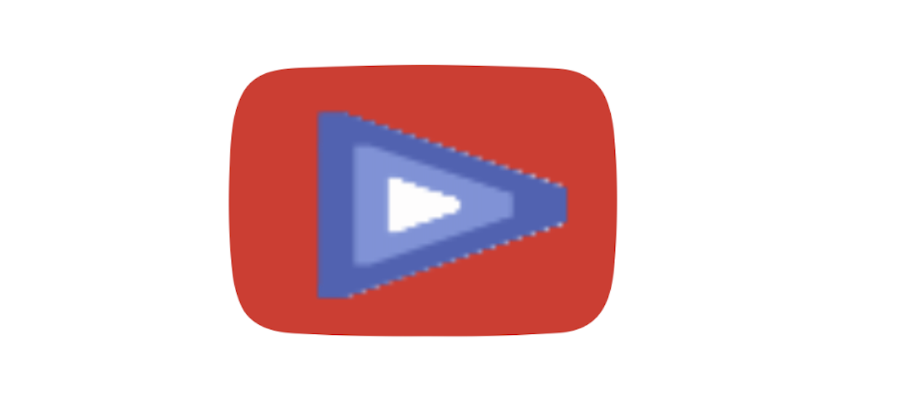

<div align="center">
  
  <h1>AttesTube</h1>
  <p>
    AttesTube is a cutting-edge platform for on-chain attestation of YouTube video comments using Ethereum Attestation Service (EAS).
  </p>
  <p>
    🚀 Dive into a new era of video feedback with transparent and verified comments, ratings, and recommendations!
  </p>
</div>

## Table of Contents

- [About](#about)
- [Features](#features)
- [Technologies Used](#technologies-used)
- [Getting Started](#getting-started)
- [Usage](#usage)


## About

AttesTube is designed to revolutionize how feedback is provided on YouTube videos. By leveraging Ethereum's blockchain through the Ethereum Attestation Service (EAS), AttesTube ensures that all comments, ratings, and recommendations are secure, verifiable, and tamper-proof. This enhances the reliability of user feedback and helps maintain a transparent and trustworthy ecosystem.

### Project Goals

- **Enhanced Transparency**: All feedback is recorded on the blockchain, ensuring transparency and accountability.
- **Secure Feedback**: Attested comments and ratings are protected from tampering and fraud.
- **User Trust**: By providing verifiable feedback, AttesTube aims to increase user trust and engagement.

## Features

- 📹 **On-Chain Attestation**: Comments, ratings, and recommendations are securely stored and verified on the Ethereum blockchain.
- 💬 **Video Comments**: View and interact with comments on videos, all backed by blockchain attestations.
- ⭐ **Ratings**: See aggregated ratings and review scores for each video.
- 🔍 **Recommendations**: Receive personalized video recommendations based on verified user feedback.
- 🖥️ **Responsive Design**: Enjoy a seamless and responsive user experience across all devices.
- ⚡ **Fast and Efficient**: Optimized for performance to provide a smooth and quick browsing experience.

## Technologies Used

- **React.js**: A powerful JavaScript library for building dynamic user interfaces.
- **Redux**: A predictable state container for JavaScript apps, enabling centralized state management.
- **Tailwind CSS**: A utility-first CSS framework for rapidly building custom user interfaces.
- **Ether.js**: A comprehensive library for interacting with the Ethereum blockchain.
- **Ethereum Attestation Service (EAS)**: Provides a decentralized method for verifying the authenticity of feedback on the blockchain.

## Getting Started

Follow these steps to set up AttesTube on your local machine:

### Prerequisites

- **Node.js**: Ensure you have Node.js and npm (or yarn) installed. You can download Node.js from [nodejs.org](https://nodejs.org/).
- **Ethereum Wallet**: You'll need an Ethereum wallet like MetaMask to interact with the blockchain.

### Installation

1. **Clone the repository:**
    ```bash
    git clone https://github.com/yourusername/attes-tube.git
    cd attes-tube
    ```

2. **Install project dependencies:**
    ```bash
    npm install
    # or
    yarn install
    ```

3. **Deploy the smart contracts**: Set up your Ethereum development environment (e.g., Hardhat, Truffle) and deploy the smart contracts as per the project's instructions.

4. **Run the development server:**
    ```bash
    npm start
    # or
    yarn start
    ```

5. **Access the app**: Open your browser and navigate to `http://localhost:3000` to start using AttesTube.

## Usage

1. **Connect Your Wallet**: Connect your Ethereum wallet (e.g., MetaMask) to the application to interact with blockchain features.
2. **Explore YouTube Videos**: Browse and search for YouTube videos within the app.
3. **View Comments**: Read comments on videos, which are verified through blockchain attestation.
4. **Check Ratings**: Review aggregated ratings for each video, with all data stored on-chain.
5. **Get Recommendations**: Explore recommendations based on blockchain-verified feedback from other users.
6. **Provide Feedback**: Rate and comment on videos, with your feedback securely recorded on the blockchain.

